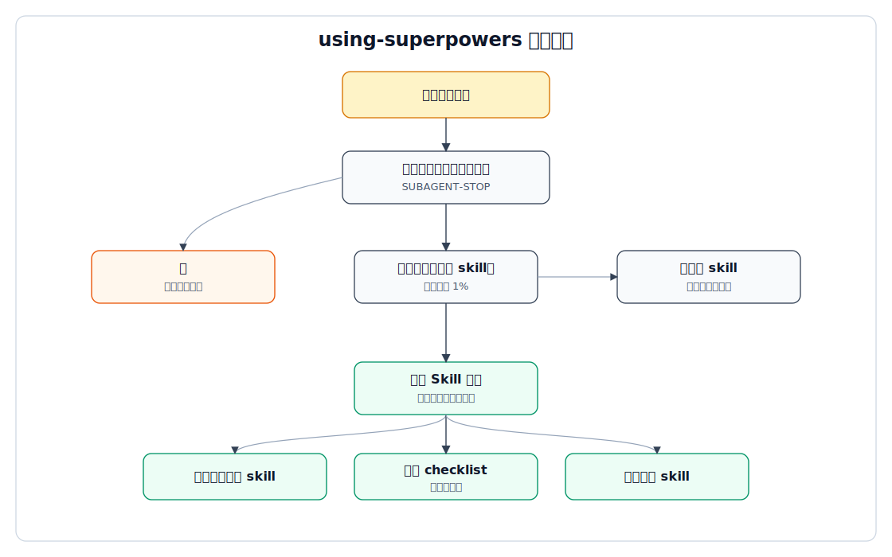

# using-superpowers 技能分析

## 1. 技能定位

`using-superpowers` 是 Superpowers 的入口纪律层。它本身不解决某类开发问题，而是规定代理在任何响应或行动前，必须先判断是否存在适用 skill，并在适用时加载 skill。

它的核心职责有三类：

1. 建立技能调用纪律：相关或被点名的 skill 必须先加载。
2. 定义指令优先级：用户显式指令高于 Superpowers skill，高于默认系统提示。
3. 提供跨平台工具映射：不同宿主用不同方式激活 skill。

## 2. 触发条件

源码 frontmatter 中的触发条件是“开始任意会话时使用”。这说明它不是普通业务 skill，而是会话级 bootstrap。

它还包含一个例外：如果当前代理是被派发出来执行具体任务的 subagent，则通过 `<SUBAGENT-STOP>` 指示跳过该 skill。原因是子代理应当只接收控制器给出的任务上下文，避免重新进入全局技能调度逻辑。

## 3. 内部规则结构

| 规则块 | 作用 |
|---|---|
| `<SUBAGENT-STOP>` | 防止子代理重复加载入口技能 |
| `<EXTREMELY-IMPORTANT>` | 用强约束语言阻止代理绕过 skill 调用 |
| `Instruction Priority` | 明确用户指令优先级最高 |
| `How to Access Skills` | 说明 Claude、Copilot、Gemini 等平台如何加载 skill |
| `Platform Adaptation` | 说明非 Claude Code 平台需要工具映射 |
| `The Rule` | 核心执行规则：相关 skill 先于响应和行动 |
| `Red Flags` | 列出代理常见自我合理化话术 |
| `Skill Priority` | 多 skill 冲突时，先流程 skill，后实现 skill |
| `Skill Types` | 区分刚性技能和弹性技能 |

## 4. 执行流程



```text
收到用户消息
  |
  v
判断是否可能有适用 skill
  |
  |-- 没有 -> 直接响应或执行
  |
  |-- 有，哪怕只有 1% 可能
        |
        v
      调用平台对应的 skill 工具
        |
        v
      宣告正在使用哪个 skill
        |
        v
      如果 skill 有 checklist，则建立任务项
        |
        v
      严格遵守 skill 内容
        |
        v
      再响应、澄清或执行
```

如果即将进入计划模式，而还没有完成 brainstorming，它还会优先要求进入 `brainstorming`。这个设计把“需求先澄清”放在计划和实现之前。

## 5. 上下游关系

上游：

- 平台 hook、plugin manifest、OpenCode 插件 JS、`GEMINI.md` 等负责让宿主代理看到或加载它。

下游：

- `brainstorming`
- `systematic-debugging`
- `writing-plans`
- `test-driven-development`
- `subagent-driven-development`
- 其他所有具体流程 skill

它相当于所有 skill 的调度前置，而不是具体业务流程的一环。

## 6. 设计取舍

### 强约束优先

该 skill 使用非常强的禁止性语言，目的不是传递信息，而是改变代理行为。它主动封堵“先看一点代码”“这只是简单问题”“我记得这个 skill”等常见逃逸路径。

### 用户控制权优先

尽管它强制使用 skill，但仍明确用户显式指令最高。如果用户项目规则要求跳过 TDD，则不能用 Superpowers 的 TDD 规则覆盖用户指令。

### 流程 skill 优先

多 skill 适用时，先使用决定“如何做”的流程 skill，再使用具体实现 skill。这避免代理先进入实现细节，再回头补流程。

## 7. 风险点

| 风险 | 说明 |
|---|---|
| token 成本 | 会话启动和 skill 加载会增加上下文消耗 |
| 过度触发 | “1% 可能”策略可能让简单任务也进入流程 |
| 平台适配差异 | 不同宿主的 skill 工具名称和能力不同，需要额外映射 |
| 与用户规则冲突 | 必须正确识别用户显式规则，否则容易过度执行 Superpowers 流程 |

## 8. 源码证据

| 结论 | 文件 |
|---|---|
| 入口触发条件来自 frontmatter | `superpowers/skills/using-superpowers/SKILL.md` |
| 子代理跳过入口技能 | `superpowers/skills/using-superpowers/SKILL.md` 的 `<SUBAGENT-STOP>` |
| 用户指令优先级最高 | `superpowers/skills/using-superpowers/SKILL.md` 的 `Instruction Priority` |
| 相关 skill 必须先调用 | `superpowers/skills/using-superpowers/SKILL.md` 的 `The Rule` |
| 多 skill 时流程 skill 优先 | `superpowers/skills/using-superpowers/SKILL.md` 的 `Skill Priority` |
