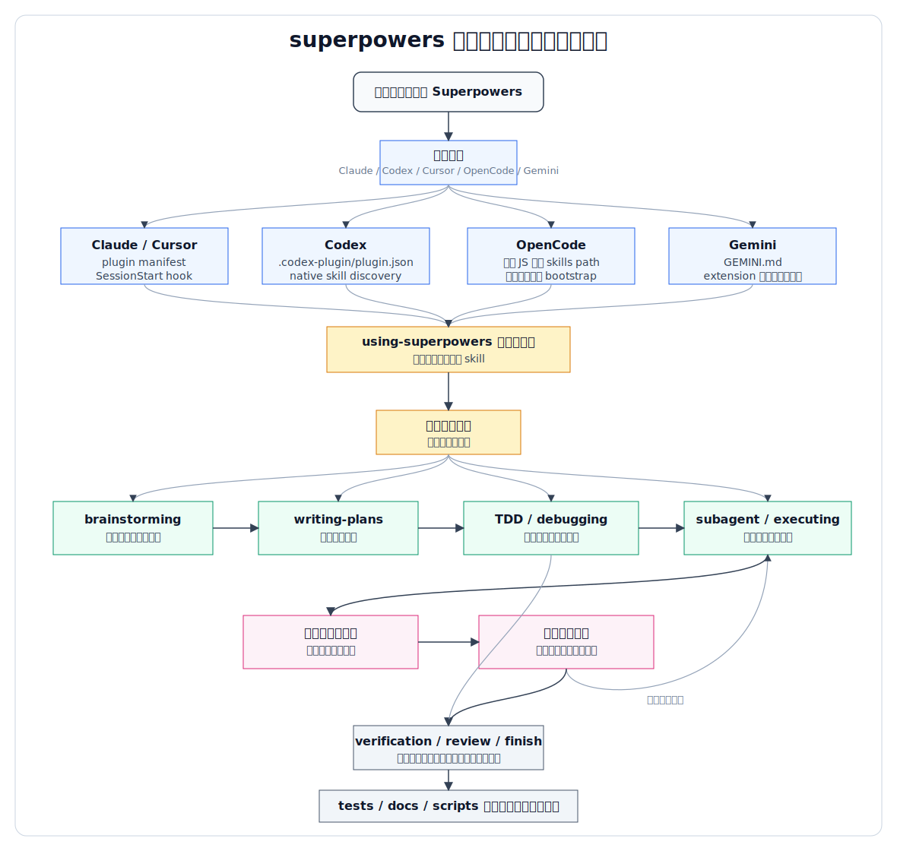

# superpowers 源码总体架构与流程说明

## 1. 定位

`superpowers` 不是一个传统 Web 服务或 SDK 项目，而是一个面向多种编码代理的“技能方法论分发仓库”。它的核心价值不是运行某个长期服务，而是把一组经过设计的 `SKILL.md` 工作流、少量命令、hook、agent 模板和平台插件清单，分发给 Claude Code、OpenAI Codex、Cursor、OpenCode、Gemini、Copilot CLI 等宿主环境。

因此，理解该仓库的主脉络时，可以把它看成三层：

1. **方法论层**：`skills/` 中的一组技能，定义代理如何分析、设计、计划、实现、测试、调试、评审和收尾。
2. **平台适配层**：各平台的 plugin manifest、hook、安装文档或注入脚本，让宿主代理能发现并加载这些技能。
3. **验证与维护层**：测试脚本、历史设计/计划文档、同步脚本和发布说明，用来维护技能质量与跨平台兼容性。

本说明只分析主脉络，忽略各技能内部的细粒度规则。

## 2. 顶层目录职责

| 路径 | 主要职责 |
|---|---|
| `skills/` | 核心技能库，每个子目录通常包含一个 `SKILL.md`，有些技能附带 prompt、脚本或参考资料。 |
| `commands/` | 旧命令入口，目前主要提示用户改用对应 skill。 |
| `agents/` | 辅助 agent 模板，例如代码评审 agent。 |
| `hooks/` | 会话启动 hook，用于把 `using-superpowers` 引导内容注入宿主代理上下文。 |
| `.codex-plugin/` | Codex 插件元数据，声明技能目录、展示信息和插件能力。 |
| `.claude-plugin/` | Claude 插件元数据与 marketplace 信息。 |
| `.cursor-plugin/` | Cursor 插件元数据，声明 skills、agents、commands、hooks。 |
| `.opencode/` | OpenCode 安装说明与插件 JS，负责配置 skills path 并注入 bootstrap。 |
| `docs/` | 平台安装说明、历史设计文档、历史实施计划。 |
| `tests/` | 技能触发、显式技能请求、Claude Code 集成、OpenCode、brainstorm server 等测试。 |
| `scripts/` | 发布、版本、Codex 插件仓库同步等维护脚本。 |

## 3. 总体架构

```text
用户请求
  |
  v
宿主编码代理
  |
  |-- 平台入口/适配
  |     |-- Claude/Cursor: plugin manifest + SessionStart hook
  |     |-- Codex: native skill discovery + .codex-plugin manifest
  |     |-- OpenCode: plugin JS 注入 skills path 与 bootstrap
  |     |-- Gemini: GEMINI.md + extension manifest
  |
  v
using-superpowers 引导技能
  |
  v
技能选择与加载纪律
  |
  v
具体工作流技能
  |-- brainstorming
  |-- writing-plans
  |-- subagent-driven-development / executing-plans
  |-- test-driven-development
  |-- systematic-debugging
  |-- requesting-code-review / receiving-code-review
  |-- finishing-a-development-branch
  |
  v
代理执行代码阅读、设计、计划、实现、测试、评审、收尾
```

这个架构的关键点是：`superpowers` 本身不直接完成业务开发，而是改变代理的工作方式。它把“什么时候该先分析、什么时候该写设计、什么时候必须 TDD、什么时候请求评审”这些行为规则，包装成可被宿主代理自动发现和按需加载的技能。

## 4. 核心模块关系

### 4.1 `using-superpowers` 是入口纪律层

`skills/using-superpowers/SKILL.md` 是整个体系的启动核心。它的职责是告诉代理：在任何任务前先检查是否有适用 skill，并在适用时加载对应 skill。各平台适配层基本都围绕“让宿主代理先看到或能发现 `using-superpowers`”展开。

### 4.2 具体技能是行为模块

`skills/` 下的每个子目录是一个独立行为模块。它们不是库函数，而是面向代理的操作规程：

- `brainstorming`：把模糊想法转成可评审设计。
- `writing-plans`：把设计拆成可执行计划。
- `subagent-driven-development`：按计划派发子代理执行，并做两阶段评审。
- `executing-plans`：按计划批量执行并设置检查点。
- `test-driven-development`：约束实现必须按红绿重构推进。
- `systematic-debugging`：约束缺陷排查先找根因。
- `requesting-code-review` / `receiving-code-review`：规范评审与反馈处理。
- `using-git-worktrees` / `finishing-a-development-branch`：规范隔离工作区与收尾合并。
- `writing-skills`：指导新增或修改 skill。

### 4.3 平台适配层只负责“接入”

平台适配层不承载主要业务逻辑，它的目标是让不同宿主以自己的机制加载同一套技能：

- Codex 通过 `.codex-plugin/plugin.json` 暴露 `skills` 路径，并在安装文档中说明 skill discovery。
- Claude/Cursor 通过 plugin manifest 和 `hooks/session-start` 在会话启动时注入引导内容。
- OpenCode 通过 `.opencode/plugins/superpowers.js` 修改运行配置，将 `skills/` 加入技能路径，并把 bootstrap 注入首个用户消息。
- Gemini 通过 `GEMINI.md` 引用 `using-superpowers` 及工具映射参考。

### 4.4 测试层验证“代理行为”

测试目录重点不是测试普通函数，而是验证技能是否能被触发、是否要求正确流程、平台插件是否加载正确。唯一更接近传统代码测试的是 brainstorming 的本地 companion server，有 Node 集成测试覆盖 HTTP/WebSocket 行为。

## 5. 主要流程说明

### 5.1 安装/加载流程

```text
用户安装插件或手动克隆仓库
  |
  v
宿主平台读取 manifest / 安装说明 / extension 配置
  |
  v
平台获得 skills 目录位置
  |
  v
会话启动时加载或注入 using-superpowers
  |
  v
代理开始按 skill discipline 处理后续请求
```

不同平台的实现方式不同，但目标一致：让宿主代理知道 `skills/` 在哪里，并在会话开始时建立“必须检查和使用技能”的行为约束。

### 5.2 标准开发方法论流程

README 中给出的主线流程可以简化为：

```text
想法/需求
  |
  v
brainstorming：澄清目标，形成设计
  |
  v
using-git-worktrees：建立隔离工作区
  |
  v
writing-plans：拆成可执行任务
  |
  v
subagent-driven-development 或 executing-plans：执行计划
  |
  v
test-driven-development：实现时强制测试先行
  |
  v
requesting-code-review / receiving-code-review：评审与修正
  |
  v
finishing-a-development-branch：验证、合并、PR 或保留工作区
```

这条主线体现的是“先设计、再计划、再实现、再验证”的代理工程流程，而不是让代理直接从用户一句话跳到改代码。

### 5.3 单次会话处理流程

```text
用户发起请求
  |
  v
using-superpowers 判断是否有相关技能
  |
  v
加载最匹配的技能
  |
  v
技能决定下一步动作
  |-- 需要澄清：按技能规则提问
  |-- 需要设计：进入 brainstorming
  |-- 需要计划：进入 writing-plans
  |-- 需要实现：进入 TDD / plan execution
  |-- 遇到故障：进入 systematic-debugging
  |-- 准备完成：进入 verification / review / finish
  |
  v
输出结果或进入下一阶段
```

### 5.4 子代理开发流程

`subagent-driven-development` 是仓库中较核心的协作流程。主流程是：

```text
读取实施计划
  |
  v
为每个任务派发实现子代理
  |
  v
实现子代理完成代码、测试、自查
  |
  v
规格符合性评审子代理检查是否满足计划
  |
  v
代码质量评审子代理检查实现质量
  |
  v
有问题则回到实现子代理修正
  |
  v
任务完成，继续下一个任务
  |
  v
全量最终评审与分支收尾
```

该流程的重点不是并发本身，而是“每个任务 fresh context + 实现后双重评审 + 问题回修”的闭环。

### 5.5 Brainstorm visual companion 流程

`brainstorming` 技能附带一个本地可视化 companion server，代码在 `skills/brainstorming/scripts/server.cjs`。它是仓库中少数真正运行时组件之一：

```text
brainstorming 需要视觉辅助
  |
  v
启动本地 Node HTTP/WebSocket server
  |
  v
读取/展示 brainstorm 内容目录中的 HTML
  |
  v
浏览器通过 WebSocket 接收 reload
  |
  v
用户交互事件写入状态文件
  |
  v
代理读取选择结果并继续讨论
```

这个 server 使用 Node 内置模块实现，避免把第三方运行时依赖打包进核心插件。

## 6. 维护与发布脉络

`superpowers` 仓库同时维护多平台接入形态。源码中的 manifest、hook、文档和同步脚本体现了这个发布路径：

```text
主仓库维护 skills 与平台适配文件
  |
  v
版本号与 release notes 更新
  |
  v
平台插件清单消费对应目录
  |
  v
必要时通过 scripts/sync-to-codex-plugin.sh 同步到 Codex 插件仓库
  |
  v
tests/ 下的行为测试验证关键技能与平台兼容性
```

维护重点集中在两类风险：

- **行为规则风险**：skill 文本会直接影响代理行为，因此修改 skill 需要谨慎测试。
- **平台兼容风险**：不同宿主对 hook、插件清单、技能发现、sandbox、worktree 的支持不同，适配层需要保持差异化处理。

## 7. 总流程图

下面这张图把“平台接入 -> 技能启动 -> 工作流执行 -> 验证维护”的主链路串在一起：



从这张图看，`superpowers` 的核心控制点有两个：第一是平台启动时必须让代理进入 `using-superpowers` 的技能纪律；第二是开发过程中按任务类型进入对应技能，并通过测试、评审和收尾技能形成闭环。

## 8. 一句话总结

`superpowers` 的总体架构是“以 `skills/` 为核心的代理行为操作系统”：`using-superpowers` 负责启动纪律，具体 skills 负责开发方法论，平台适配层负责把同一套方法论接入不同编码代理，测试与同步脚本负责维持跨平台可用性。
