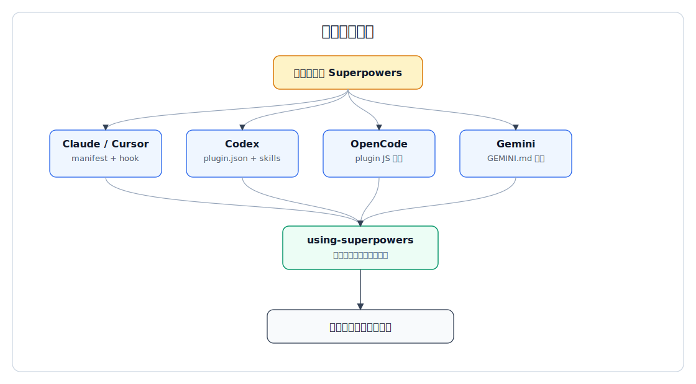
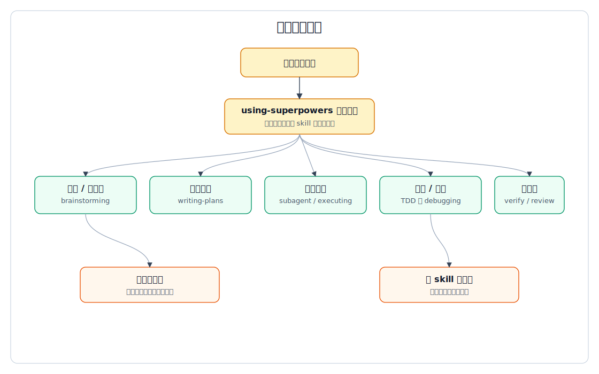
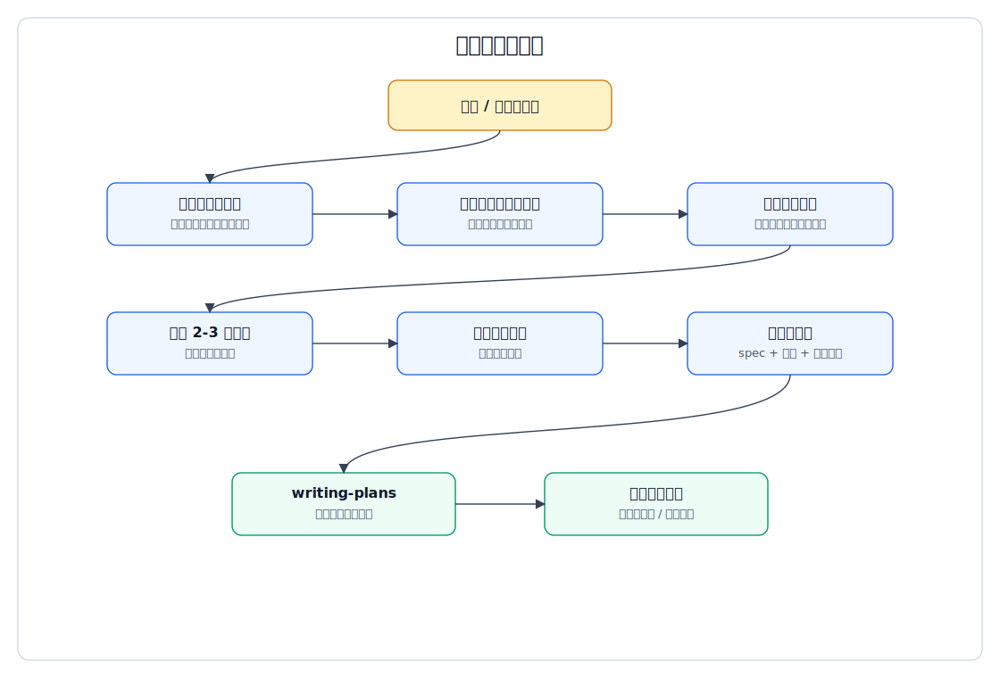
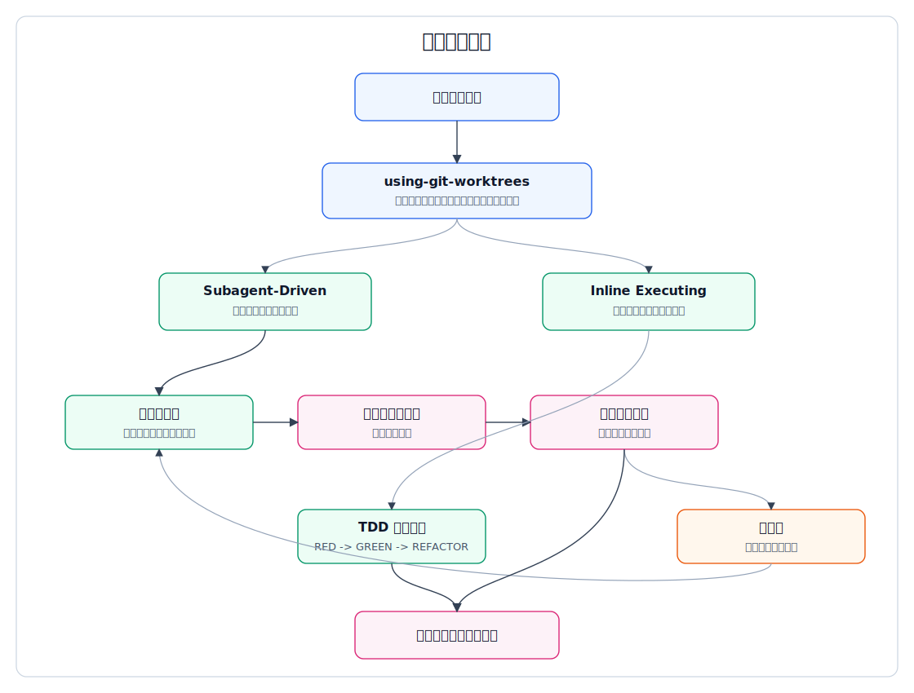
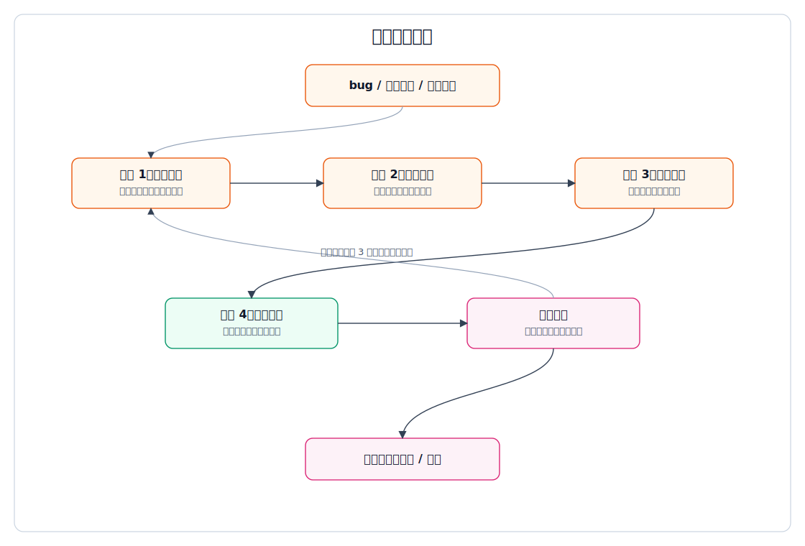
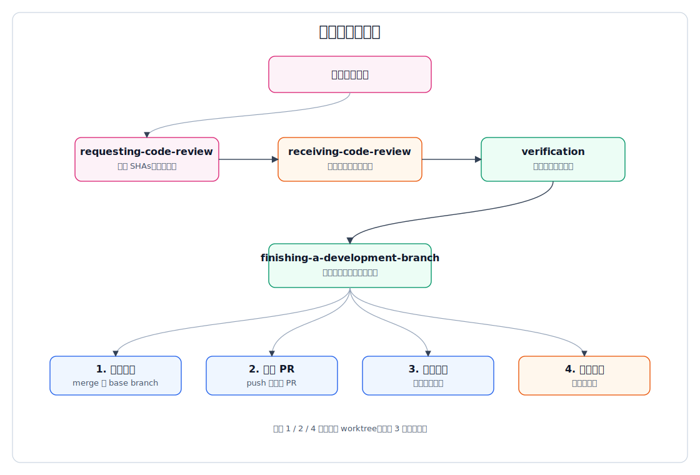

# superpowers 分支执行流程说明

本文继续基于 `superpowers` 源码做主流程展开，重点说明总体流程图中的各个分支如何执行。这里的“分支”不是 Git 分支，而是代理在运行 `superpowers` 方法论时，根据平台、请求类型、执行方式和反馈结果进入的不同流程路径。

## 1. 分支总览

| 分支 | 触发条件 | 主要入口 | 结果 |
|---|---|---|---|
| 平台接入分支 | 用户在不同宿主平台安装或启用 Superpowers | plugin manifest、hook、OpenCode 插件 JS、`GEMINI.md` | 宿主能发现 `skills/`，并让代理进入 `using-superpowers` |
| 请求分流分支 | 用户发起任意任务请求 | `using-superpowers` | 按任务语义加载对应 skill |
| 设计计划分支 | 用户提出想法、新功能、模糊需求，或已有规格需要拆计划 | `brainstorming`、`writing-plans` | 形成设计文档和实施计划 |
| 实现执行分支 | 已有实施计划或进入代码实现 | `using-git-worktrees`、`subagent-driven-development`、`executing-plans`、`test-driven-development` | 在隔离环境中按计划实现并验证 |
| 调试修复分支 | 遇到 bug、测试失败、异常行为 | `systematic-debugging`、`test-driven-development` | 找到根因，写失败测试，修复并验证 |
| 评审收尾分支 | 任务完成、准备声明完成、准备合并或 PR | `requesting-code-review`、`receiving-code-review`、`verification-before-completion`、`finishing-a-development-branch` | 评审闭环、验证完成条件、选择合并/PR/保留/丢弃 |

## 2. 平台接入分支

这一分支解决“不同宿主如何加载同一套技能”的问题。

Claude 和 Cursor 主要依赖插件清单与会话启动 hook。hook 读取 `skills/using-superpowers/SKILL.md`，把它包装成上下文注入到会话里。

Codex 依赖 `.codex-plugin/plugin.json` 暴露 `skills` 路径。安装后宿主通过原生 skill discovery 找到技能目录。

OpenCode 通过 `.opencode/plugins/superpowers.js` 做两件事：把 `skills/` 加入运行时配置，并把 `using-superpowers` 的 bootstrap 内容注入首个用户消息。

Gemini 通过 `GEMINI.md` 引用 `using-superpowers` 与工具映射资料，让 Gemini 的技能激活机制能对齐 Superpowers 的工具语义。

这个分支的终点统一为：代理进入 `using-superpowers` 的技能纪律层。

## 3. 请求分流分支

`using-superpowers` 是所有后续分支的入口纪律。它的核心规则是：只要有相关 skill，或用户明确点名 skill，就必须先加载 skill，再响应或行动。

常见分流如下：

| 请求类型 | 进入分支 |
|---|---|
| 新功能、创意、修改行为、模糊需求 | `brainstorming` |
| 已有规格或需求，需要拆实施步骤 | `writing-plans` |
| 已有计划，要开始执行 | `subagent-driven-development` 或 `executing-plans` |
| 实现功能或修 bug | `test-driven-development` |
| 出现 bug、失败测试、异常行为 | `systematic-debugging` |
| 完成前、声明通过前、提交或 PR 前 | `verification-before-completion`、`requesting-code-review`、`finishing-a-development-branch` |

这里的关键不是“关键词匹配”，而是先识别用户目标，再选择能约束代理行为的流程 skill。

## 4. 设计计划分支

设计计划分支由 `brainstorming` 进入，终点是 `writing-plans`。它主要处理“还没想清楚要做什么”或“需要先形成方案”的任务。

执行顺序：

1. 探索项目上下文：读现有文件、文档、近期提交。
2. 如果问题涉及视觉表达，先询问是否使用 visual companion。
3. 一次只问一个澄清问题，补齐目标、约束、成功标准。
4. 提出 2-3 个方案，说明取舍并给出推荐。
5. 分段展示设计，让用户逐段确认。
6. 写设计文档，做占位符、矛盾、范围和歧义自查。
7. 等用户复核设计文档。
8. 进入 `writing-plans`，把设计拆成 2-5 分钟粒度的小任务。
9. 计划完成后，让用户选择子代理驱动或内联执行。

这个分支的关键约束是：设计未获确认前，不进入实现。

## 5. 实现执行分支

实现执行分支从“已有计划”开始。它先用 `using-git-worktrees` 建立或确认隔离工作区，再选择执行模式。

执行前置：

1. 选择 worktree 目录。
2. 验证项目本地 worktree 目录是否被忽略。
3. 创建新 worktree 和分支。
4. 运行项目 setup。
5. 跑基线测试，确认开始前状态。

执行方式分为两支：

| 方式 | 适用条件 | 执行特征 |
|---|---|---|
| `subagent-driven-development` | 有子代理能力，计划任务相对独立 | 每个任务派发 fresh subagent，随后做规格符合性评审和代码质量评审 |
| `executing-plans` | 无子代理能力，或需要当前会话内批量推进 | 读取计划，按任务逐项执行，遇到疑问或偏差停下来问用户 |

实现过程中，`test-driven-development` 约束每个功能或修复按 RED -> GREEN -> REFACTOR 推进。若实现子代理返回 `NEEDS_CONTEXT` 或 `BLOCKED`，主流程不能硬推，需要补上下文、换模型、拆任务，或升级给用户。

## 6. 调试修复分支

调试修复分支由 `systematic-debugging` 驱动。它在遇到 bug、失败测试或异常行为时优先触发，避免直接猜修复。

四个阶段：

1. 根因调查：读错误、稳定复现、看近期变化、收集多组件证据、追踪数据流。
2. 模式分析：找可工作的参考实现，比较差异，理解依赖。
3. 假设验证：一次只提出一个假设，用最小实验验证。
4. 实施修复：为根因创建失败测试，然后做单一修复并验证。

如果修复无效，回到调查或假设阶段。若连续多次失败，需要质疑架构或前提，而不是继续叠补丁。

## 7. 评审收尾分支

评审收尾分支负责“不要过早宣布完成”。它由三个动作组成：评审、验证、收尾。

评审流程：

1. `requesting-code-review` 获取 git SHAs。
2. 派发代码评审 agent。
3. 根据评审反馈处理问题。
4. 如果收到外部反馈，`receiving-code-review` 要求先理解、验证、评估，再逐项实现。

完成前验证：

1. 明确要证明的完成声明。
2. 找到能证明它的命令。
3. 运行完整命令。
4. 读取完整输出和退出码。
5. 确认输出真的支持完成声明后，才能说完成。

收尾流程：

1. `finishing-a-development-branch` 先跑测试。
2. 测试失败则停止，不展示合并选项。
3. 测试通过后识别 base branch。
4. 给用户四个选项：本地合并、推送 PR、保留分支、丢弃工作。
5. 对丢弃工作必须先确认。
6. 对合并、PR、丢弃路径清理 worktree；保留分支则不清理。

## 8. 分支间关系

这些分支不是互斥的一次性路径，而是可以回跳的闭环：

- 设计发现范围过大，可以回到需求澄清。
- 计划发现规格缺口，可以回到设计。
- 实现遇到异常，可以转入调试修复。
- 评审发现偏差，可以回到实现执行。
- 验证失败，不能完成，必须回到对应问题分支。

所以 `superpowers` 的流程更像一个带质量门的状态机：每个阶段都有进入条件、退出条件和失败回路。

## 9. HTML 预览

如果 Markdown 预览器不显示 SVG，可以直接打开：

`docs/codex/v1/designs/assets/superpowers-branch-flows.html`
